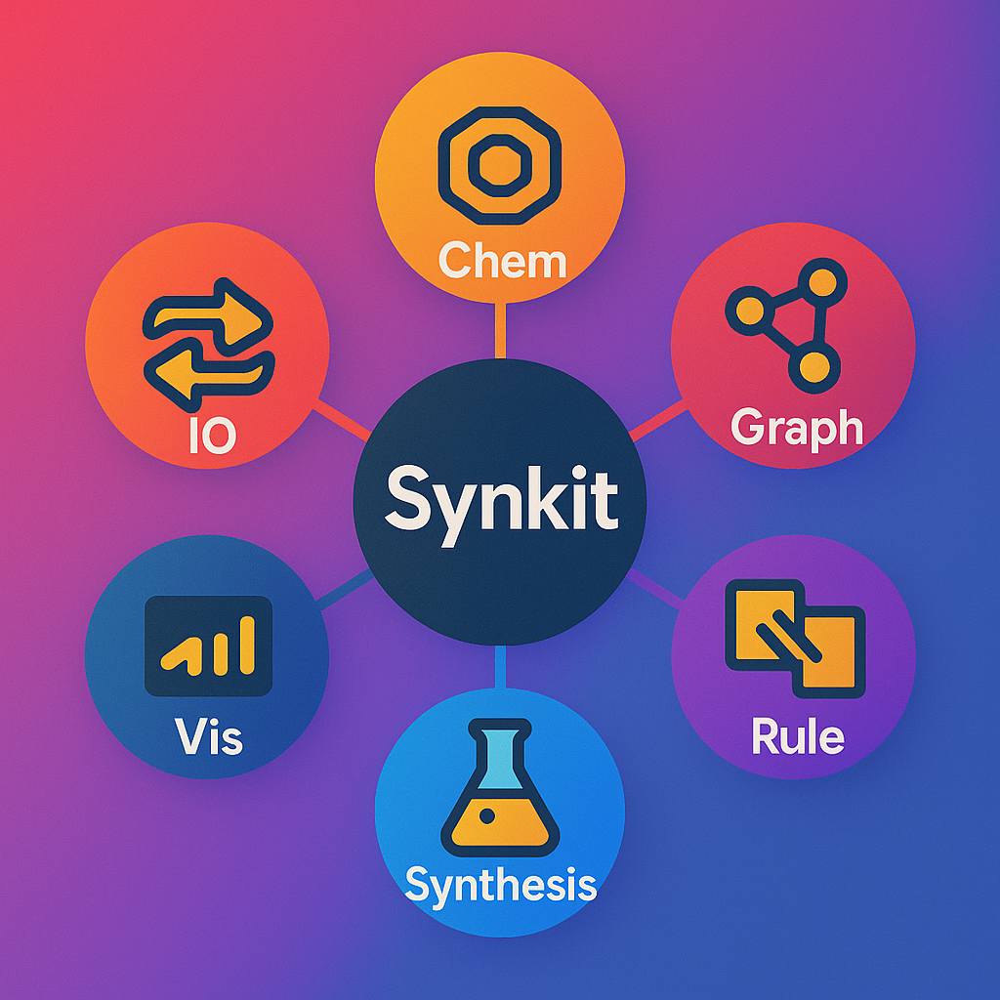

.. _synkit-home:

SynKit
======

.. raw:: html

   

     
     
     
     
     
   

**SynKit** is a graph-based Python toolkit for reaction informatics: canonicalization, matching,
rule manipulation, and lightweight chemical reaction network (CRN) exploration.
It is designed to be modular, extensible, and friendly for both research and
production workflows.

.. Core features
.. -------------

.. .. grid:: 1 1 2 2
..    :gutter: 2

..    .. grid-item-card::

..       :octicon:`rocket` **Canonicalization**

..       Reduce duplicate representations for molecules, reactions and CRNs.
..       Supports exact and WL-based approximate backends for scale.

..    .. grid-item-card::

..       :octicon:`search` **Matching & Isomorphism**

..       Fast component-aware subgraph search with symmetry-aware deduplication.

..    .. grid-item-card::

..       :octicon:`gear` **Rule objects and Transformation Workflows**

..       Treat transformations as first-class objects (templates, ITS graphs, gluing).

..    .. grid-item-card::

..       :octicon:`graph` **CRN**

..       Build, canonicalize, and analyze chemical reaction networks (directed/hypergraphs).

..    .. grid-item-card::

..       :octicon:`sync` **IO Conversion**

..       Convert SMILES/SMARTS/GML and move between RDKit ↔ NetworkX representations.

..    .. grid-item-card::

..       :octicon:`terminal` **API & CLI**

..       API with convenient CLI entrypoints for common tasks.

Documentation quick links
-------------------------

.. grid:: 1 2 2 3
   :gutter: 2

   .. grid-item-card:: :octicon:`rocket` Getting Started
      :link: getting_started
      :link-type: doc

      Install, quick examples, and basic usage.

   .. grid-item-card:: :octicon:`graph` CRN
      :link: crn
      :link-type: doc

      CRN building, hypergraph conversions, canonicalization utilities.

   .. grid-item-card:: :octicon:`sync` IO Conversion
      :link: io
      :link-type: doc

      Readers/writers and format conversion recipes.

   .. grid-item-card:: :octicon:`beaker` Chemical Modeling
      :link: chem
      :link-type: doc

      Reaction validation, AAM checks, balance and fingerprinting.

   .. grid-item-card:: :octicon:`share-android` Graph Algorithms
      :link: graph
      :link-type: doc

      ITS/MTG construction, WL hashing, and cluster/search primitives.

   .. grid-item-card:: :octicon:`terminal` API Reference
      :link: api
      :link-type: doc

      Auto-generated API docs and class references.

Citation
--------

Please cite **SynKit** when used in published work. Prefer the archived DOI for a specific release
and include the Git commit/tag for reproducibility.

~~~~~~~

.. code-block:: bibtex

   @article{phan2025synkit,
     title = {SynKit: A Graph-Based Python Framework for Rule-Based Reaction Modeling and Analysis},
     author = {Phan, Tieu-Long and others},
     year = {2025},
     doi = {10.5281/zenodo.15269901}
   }

Contributions & support
-----------------------
Report issues or feature requests on GitHub: https://github.com/TieuLongPhan/SynKit/issues  
To contribute: fork, create a topic branch, add tests, and open a PR against `main`. For API changes update docs and tests.
For contribution enquiries or collaborations: **tieu@bioinf.uni-leipzig.de**

Acknowledgments
---------------
Funded by the European Union Horizon Europe Doctoral Network (Marie-Skłodowska-Curie, grant No. 101072930 — TACsy).

.. toctree::
   :maxdepth: 1
   :hidden:

   getting_started
   io
   chem
   graph
   rule
   synthesis
   crn
   api
   reference
   changelog

